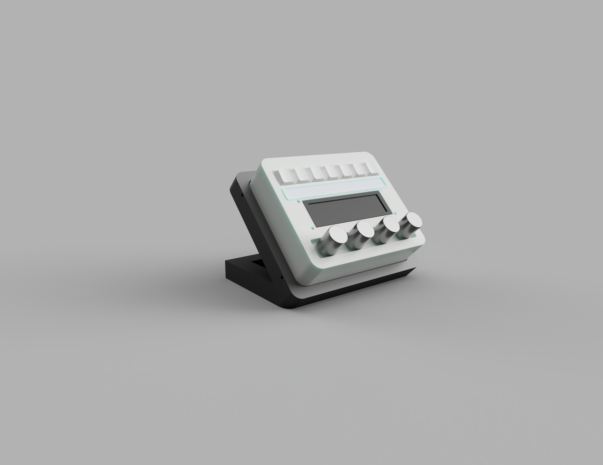

# Modular Stream Deck & Robot Controller


Ce projet est un **Stream Deck DIY** haute performance et modulaire. Conçu autour d'un **ESP32-S3**, il permet de piloter des raccourcis PC, de monitorer des ressources, mais aussi de servir de **Hub de contrôle** pour des périphériques externes (bras robotique, capteurs) via un port d'extension dédié.



---

## Spécifications Matérielles

| Composant | Détails |
| :--- | :--- |
| **Microcontrôleur** | ESP32-S3 DevKit N16R8 (16MB Flash / 8MB PSRAM) |
| **Écran** | DWIN HMI 960x480 (Interface UART, protocole DGUS II) |
| **Saisies** | 7x Switchs mécaniques (Cherry MX) + 4x Potentiomètres analogiques |
| **Alimentation** | USB-C natif (Compatible **Thunderbolt** pour forte puissance) |
| **Modularité** | Boîtier CAO avec pied indépendant et port d'extension I2C |

---

## Points Forts du Projet

### 1. Conception Modulaire (CAO)
Le boîtier a été conçu sous **Fusion 360** avec une approche modulaire :
* **Pied indépendant :** Permet d'adapter différents angles ou supports (pince de bureau, bras articulé).
* **Port d'extension :** Sortie des ports non-utilisés (SDA/SCL, 5V, GND) sur le côté pour connecter des modules sans ouvrir le boîtier.

### 2. Hub Robotique
Grâce au port d'extension, le Stream Deck peut piloter un **bras robotique** (servomoteurs) via un driver **PCA9685**. 
* **Mapping dynamique :** Les potentiomètres contrôlent directement les angles des servos lorsque le profil "Robot" est sélectionné.
* **Affichage temps réel :** L'écran DWIN affiche l'état et la position de chaque articulation.

### 3. Gestion de l'Énergie
Optimisation pour le **Thunderbolt** :
* Alimentation directe des périphériques (Écran, Servos) via la ligne **5V/Vin** pour préserver le régulateur interne de l'ESP32.
* Filtrage matériel par condensateurs (470µF - 1000µF) pour stabiliser les pics de courant des moteurs.

---

## Schéma de Câblage (Résumé)

Le projet utilise des techniques de filtrage pour garantir la précision des lectures analogiques :
* **Potentiomètres :** Condensateurs de `100nF` pour le lissage du signal.
* **Boutons :** Condensateurs de `10nF` pour le debounce matériel.
* **Communication Écran :** Liaison série directe (3.3V TTL) sur Rx2/Tx2.

---

## Structure du Dépôt

```text
├── Hardware/           # Fichiers STEP/STL (Fusion 360)
├── Firmware/           # Code source ESP32 (Arduino IDE / PlatformIO)
├── DWIN_Project/       # Fichiers de configuration DGUS II (Interface graphique)
├── Scripts_PC/         # Script de détection d'application (Python/C#)
└── Assets/             # Icônes et ressources graphiques