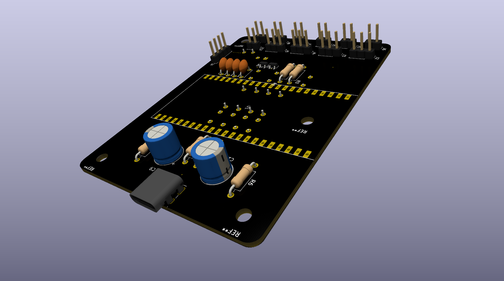

# KORE DECK

<p align="center">
  
</p>

<p align="center">
  
  
  
</p>

<h3 align="center">
Un Hub de Control Modulaire pour PC et Robotique/A Modular Stream Deck & Robotics Control Hub (cf : Robotic_Arm)
</h3>

---

##  Video de présentation/Cinematic Demo


https://github.com/user-attachments/assets/3f7520e6-ee07-4d92-a84f-97e8f2b0d568


<p align="center">
  
</p>


---

## Description

Ce projet est un **Stream Deck DIY** développé dans le but d'être modulaire.  
Conçu autour d'un **ESP32-S3**, il permet de piloter des raccourcis PC, de monitorer des ressources, mais aussi de servir de **Hub de contrôle** pour des périphériques externes (bras robotique, capteurs) via un port d'extension dédié.

This project is a **DIY Stream Deck** designed to be modular.  
Built around an **ESP32-S3**, it allows you to control PC shortcuts, monitor system resources, and serve as a **control hub** for external devices (such as robotic arms and sensors) via a dedicated expansion port.

---


# Spécifications Matérielles

| Composant | Détails |
| :--- | :--- |
| **Microcontrôleur** | ESP32-S3 DevKit N16R8 (16MB Flash / 8MB PSRAM) |
| **Écran** | DWIN HMI 960x240 (Interface UART, protocole DGUS II) |
| **Capteurs** | 7x Switchs mécaniques (Cherry MX) + 4x Potentiomètres analogiques |
| **Alimentation** | USB-C natif (Compatible **Thunderbolt** pour forte puissance) |
| **Modularité** | Boîtier CAO avec pied indépendant et port d'extension I2C |

---

# Points Forts du Projet

## 1. Conception Modulaire (CAO)

Le boîtier a été conçu sous **Fusion 360** avec une approche modulaire :

- **Pied indépendant :**  
  Permet d'adapter différents angles ou supports (pince de bureau, bras articulé).

- **Port d'extension :**  
  Sortie des ports non-utilisés (SDA/SCL, 5V, GND) sur le côté pour connecter des modules sans ouvrir le boîtier.

- **Modularité du Software/Firmware**
  Pensé dans le but d'être mobile et évolutif (rajout facile à intégrer)


The Case was designed in **Fusion 360** using a modular approach:

- **Detachable stand:**  
  Allows for different angles or mounts (desk clamp, articulated arm).

- **Expansion port:**  
  Unused ports (SDA/SCL, 5V, GND) are routed to the side to connect modules without opening the enclosure.

- **Software/Firmware Modularity**
  Designed to be portable and scalable (easy to integrate new features)


---

## 2. Hub Robotique/Robotics Hub

Grâce au port d'extension, le Stream Deck peut piloter un **bras robotique** (servomoteurs) via un driver **PCA9685**.

- **Mapping dynamique :**  
  Les potentiomètres contrôlent directement les angles des servos lorsque le profil `Robot` est sélectionné.

- **Affichage temps réel :**  
  L'écran DWIN affiche l'état et la position de chaque articulation.

Thanks to the expansion port, the Stream Deck can control a **robotic arm** (servo motors) via a **PCA9685** driver.

- **Dynamic mapping:**  
  The potentiometers directly control the servo angles when the `Robot` profile is selected.

- **Real-time display:**  
  The DWIN screen displays the status and position of each joint.

---

## 3. Gestion de l'Énergie/Energy Management

Optimisation pour le **Thunderbolt** :

- Alimentation directe des périphériques (Écran, Servos) via la ligne **5V/Vin** pour préserver le régulateur interne de l'ESP32.

- Filtrage matériel par condensateurs (`470µF` → `1000µF`) pour stabiliser les pics de courant des moteurs.

Optimization for **Thunderbolt**:

- Direct power supply to peripherals (display, servos) via the **5V/Vin** line to preserve the ESP32’s internal voltage regulator.

- Hardware filtering using capacitors (`470µF` → `1000µF`) to stabilize motor current spikes.

---

# Schéma de Câblage (Résumé)/Wiring Diagram (Summary)

Le projet utilise des techniques de filtrage pour garantir la précision des lectures analogiques :

- **Potentiomètres :**  
  Condensateurs de `100nF` pour le lissage du signal.

- **Boutons :**  
  Condensateurs de `10nF` pour le debounce matériel.

- **Communication Écran :**  
  Liaison série directe (`3.3V TTL`) sur `Rx2/Tx2`.

The project uses filtering techniques to ensure the accuracy of analog readings:

- **Potentiometers:**  
  `100nF` capacitors for signal smoothing.

- **Buttons:**  
  `10nF` capacitors for hardware debouncing.

- **Display communication:**  
  Direct serial connection (`3.3V TTL`) on `Rx2/Tx2`.

---

# Structure du Dépôt/Structure of the Repository

```text
├── Hardware/           # Fichiers STEP/STL (Fusion 360)/STEP/STL files (Fusion 360)
├── Firmware/           # Code source ESP32 (Arduino IDE / PlatformIO)/ESP32 source code (Arduino IDE / PlatformIO)
├── DWIN_Project/       # Fichiers de configuration DGUS II (Interface graphique)/DGUS II Configuration Files (Graphical Interface)
├── Scripts_PC/         # Script de détection d'application (Python/C#)/Application detection script (Python/C#)
└── Assets/             # Icônes, vidéos et ressources graphiques/Icons, videos, and graphic resources
```

---

# Roadmap

- [ ] Interface UI avancée/Advanced UI
- [ ] Gestion multi-profils/Multi-profile management
- [ ] Intégration MQTT/MQTT integration
- [ ] Contrôle robotique avancé/Advanced robotics control
- [ ] Monitoring système temps réel/Real-time system monitoring
- [ ] Support Wi-Fi / Bluetooth/Wi-Fi / Bluetooth support
- [ ] Intégration Home Assistant/Home Assistant integration

---

# Technologies Utilisées/Technologies Used

- **ESP32-S3**
- **DGUS II / DWIN HMI**
- **Fusion 360**
- **Arduino / PlatformIO**
- **Python / C#**
- **I2C / UART**

---

# Auteur/Author

Projet conçu et développé par **OLYPTEA** (Sacha Gibert).

Project designed and developed by **OLYPTEA** (Sacha Gibert).

GitHub :  
https://github.com/OLYPTEA

---

Merci d'avoir pris le temps de regarder le projet

Thank you for taking the time to look at the project

---

